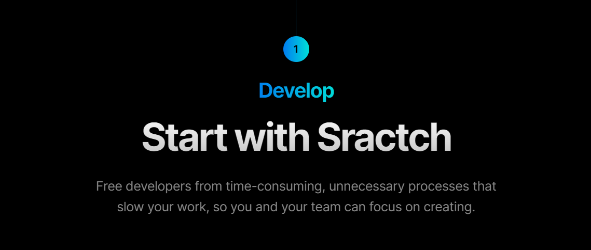

# DOM Challenges 

The CodeFile.js contains a total of 20 dom manipulation codes. Here are the 7 out of the 20 which were most fun


### Challenge
- Get Element By Id, Create Element, Create Text Node, Append Child


```js
let parent = document.querySelector("#hcfe-content > section > div > div > article > nav")

let newSection = document.createElement('section')
let newHeading = document.createElement('h3')
newSection.className = 'parent'
newHeading.textContent = 'My New FAQ'
newSection.appendChild(newHeading)

parent.appendChild(newSection)
```


### Challenge

-  Change the description colour black to orange


```js
document.querySelector(".desc").style.color = 'orange'
```


### Challenge
- Change the logo Image


```js
let newTag = document.createElement('img')
newTag.src = 'https://ineuron.ai/images/ineuron-logo.png'
newTag.width = '100'
newTag.height = '30'
document.querySelector("body > header > div > a").childNodes[0].remove()
document.querySelector("body > header > div > a").appendChild(newTag)
```


### Challenge 

- Change the background colour of the button to blue.


```js
document.querySelector("body > div.application-main > div > aside > div > loading-context > div > div.mb-3.Details.js-repos-container.mt-5 > div > h2 > a").style.backgroundColor = 'blue'

```


### Challenge

- Change Background Color on Hover to Red


```js
let text = document.querySelector(".login-btn-text")
function changeColor() {
text.style.backgroundColor = 'red'
}
text.addEventListener('mouseover', changeColor)
```


- Change Title 


```js
document.querySelector('.section-title_title__VEDfK').innerText = 'Start with Sractch'
```




```js
document.querySelector("div.HotDealsAll__Heading__2fIbe").style.fontSize = '80px'
```
